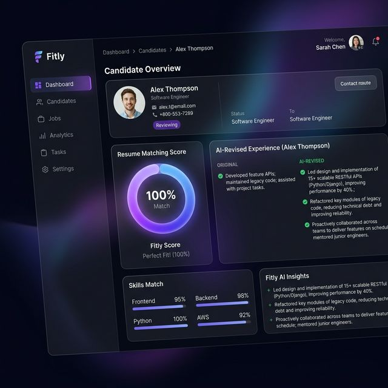

<p align="center">
  
</p>

# Fitly

An intelligent, full-stack Applicant Tracking System designed to match candidate resumes with job descriptions using exact-keyword matching and generative AI.

<p align="center">
  
</p>

## ✨ Features
- **Smart Resume Parsing**: Upload a PDF or paste plain text. The system automatically extracts the relevant information.
- **Exact-Match Scoring**: Calculates a strict percentage score based on how many Job Description keywords appear in the resume.
- **Auto-Revise AI (Gemini)**: If a resume scores low, the built-in AI will automatically rewrite the resume to guarantee a 100% keyword match against the strict parsing algorithm, natively weaving the keywords into the experience section.
- **Premium UI**: Built with Next.js and Tailwind CSS, featuring glassmorphism, dynamic glowing animated backgrounds, and smooth micro-interactions.

## 🏗️ Architecture
The project is split into three decoupled services:
1. **Frontend (`/frontend`)**: Next.js (React) application with Tailwind CSS.
2. **Backend (`/backend`)**: Node.js & Express API for score calculation and orchestration.
3. **AI Service (`/ai`)**: Python Flask API using `google-generativeai` (Gemini 2.5 Flash) and `pdfplumber` for text extraction.

---

## 🚀 Local Setup

### 1. Prerequisites
- Node.js (v18+)
- Python (v3.10+)
- A Google Gemini API Key

### 2. Frontend Setup
```bash
cd frontend
npm install
npm run dev
# Runs on http://localhost:3001
```

### 3. Backend Setup
```bash
cd backend
npm install
node index.js
# Runs on http://localhost:5000
```

### 4. AI Service Setup
```bash
cd ai
python -m venv venv
# Windows: .\venv\Scripts\activate
# Mac/Linux: source venv/bin/activate
pip install -r requirements.txt
```
Create a `.env` file in the `/ai` directory:
```env
GEMINI_API_KEY=your_google_ai_studio_api_key_here
```
Run the Python Flask server:
```bash
python app.py
# Runs on http://localhost:8000
```

## 📜 License & Attribution
Made by **Prakul Patel** | Copyright © 2026 Fitly
